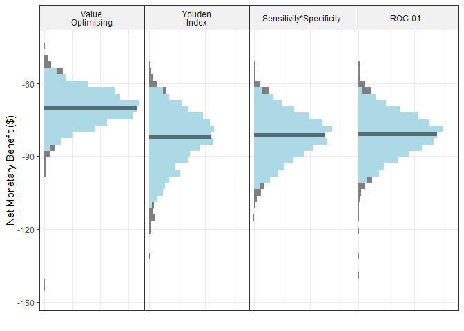
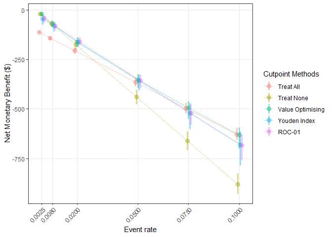

analyses
================
Rex Parsons
2022-12-09

``` r
get_nmb <- function() {
  # WTP from Edney et al (2018), Pharmacoeconomics
  WTP <- params$global$WTP
  # treatment_effect taken from: Haines et al. (2010) Archives of Internal Medicine
  treatment_effect <- exp(rnorm(
    1,
    mean = params$falls$treatment_log_hazard$mean,
    sd = params$falls$treatment_log_hazard$sd
  ))
  # taken from abstract of Hill (2015), Lancet
  treatment_cost <- params$falls$treatment_cost
  # taken from Morello et al (2015). MJA
  falls_cost <-
    rgamma(
      1,
      params$falls$falls_cost$shape,
      params$falls$falls_cost$rate
    ) * params$falls$falls_cost$multiplier
  # taken from Latimer et al (2013) Age and Ageing
  fall_eff <- rbeta(
    1,
    params$falls$fall_decrement$shape1,
    params$falls$fall_decrement$shape2
  ) * 0.5 # Latimer conducted 6-month follow-up <- 0.5*utility = QALY
  c(
    "TN" = 0,
    "FN" = -falls_cost - fall_eff * WTP,
    "TP" = -falls_cost * (1 - treatment_effect) - treatment_cost - fall_eff * WTP,
    "FP" = -treatment_cost
  )
}

# the same as get_nmb for falls but returns only the point estimates.
get_nmb_est <- function() {
  WTP <- params$global$WTP
  # treatment_effect taken from: Haines et al. (2010) Archives of Internal Medicine
  treatment_effect <- exp(params$falls$treatment_log_hazard$mean)
  # taken from abstract of Haines (2010), BMC Medicine
  treatment_cost <- params$falls$treatment_cost
  # taken from Morello et al (2015). MJA
  falls_cost <- 6669 * params$falls$falls_cost$multiplier
  # taken from Latimer et al (2013) Age and Ageing
  fall_eff <- 0.04206168 * 0.5 # Latimer conducted 6-month follow-up <- 0.5*utility = QALY
  c(
    "TN" = 0,
    "FN" = -falls_cost - fall_eff * WTP,
    "TP" = -falls_cost * (1 - treatment_effect) - treatment_cost - fall_eff * WTP,
    "FP" = -treatment_cost
  )
}
```

# Primary analyses (inpatient falls)

``` r
cl <- parallel::makeCluster(parallel::detectCores())

if("primary_analyses_sim.rds" %in% list.files("sim_objects")) {
  sim <- readRDS("sim_objects/primary_analyses_sim.rds")
} else {
  sim <- do_nmb_sim(
    n_sims = 2500, n_valid = 10000, sim_auc = 0.75,
    event_rate = 0.008, fx_nmb_training = get_nmb, fx_nmb_evaluation = get_nmb_est,
    cl = cl
  )
  
  saveRDS(sim, "sim_objects/primary_analyses_sim.rds")
}

rename_vec <- c("Treat All" = "all",
                "Treat None" = "none", 
                "Value Optimising" = "value optimising", 
                "Youden Index" = "youden",
                "Sensitivity*Specificity" = "prod sens spec",
                "ROC-01" = "roc01")

methods_show_cutpoint_methods_only <- c("Value Optimising",
                                        "Youden Index",
                                        "Sensitivity*Specificity",
                                        "ROC-01")

methods_show <- c("Treat All",
                  "Treat None",
                  "Value Optimising",
                  "Youden Index",
                  "Sensitivity* Specificity",
                  "ROC-01")

plot(sim, rename_vector = rename_vec, methods_order = methods_show_cutpoint_methods_only)
```

<!-- -->

``` r
ggsave("output/primary-analyses.png", dpi=1200, width=7, height=5)


primary_analyses_ft <- 
  make_summary_table(sim, rename_vector=rename_vec) %>% 
  arrange(desc(median)) %>%
  filter(method %in% methods_show_cutpoint_methods_only) %>%
  rename("Cutpoint Method" = method, "Median NMB ($)" = median) %>%
  flextable() %>%
  autofit() 

save_as_docx(primary_analyses_ft, path="output/primary-analyses-table.docx")
```

# Sensitivity analyses (inpatient falls)

``` r
if("sim-screen-auc.rds" %in% list.files("sim_objects")) {
  sim_screen_auc <- readRDS("sim_objects/sim-screen-auc.rds")
} else {
  sim_screen_auc <- screen_simulation_inputs(
    n_sims = 2500, n_valid = 10000, sim_auc = seq(0.6, 0.95, 0.05),
    event_rate = 0.008, fx_nmb_training = get_nmb, fx_nmb_evaluation = get_nmb_est,
    cl = cl
  )
  saveRDS(sim_screen_auc, "sim_objects/sim-screen-auc.rds")
}

plot(
  sim_screen_auc, 
  rename_vector = rename_vec, 
  methods_order = methods_show, 
  dodge_width = 0.015,
  plot_range=F
)
```

    ## No value for 'x_axis_var' given.

    ## Screening over sim_auc by default

<!-- -->

``` r
ggsave("output/auc-screen.png", dpi=1200, width=7, height=5)


if("sim-screen-event-rate.rds" %in% list.files("sim_objects")) {
  sim_screen_event_rate <- readRDS("sim_objects/sim-screen-event-rate.rds")
} else {
  sim_screen_event_rate <- screen_simulation_inputs(
    n_sims = 2500, n_valid = 10000, sim_auc = 0.75,
    event_rate = c(0.0025, 0.008, 0.02, 0.05, 0.075, 0.1), 
    fx_nmb_training = get_nmb, fx_nmb_evaluation = get_nmb_est,
    cl = cl
  )
  saveRDS(sim_screen_event_rate, "sim_objects/sim-screen-event-rate.rds")
}


plot(
  sim_screen_event_rate, 
  rename_vector = rename_vec, 
  methods_order = methods_show, 
  dodge_width = 0.003,
  plot_alpha=0.4,
  plot_range=F
) +
  guides(x=guide_axis(angle=45))
```

    ## No value for 'x_axis_var' given.

    ## Screening over event_rate by default

<!-- -->

``` r
ggsave("output/event-rate-screen.png", dpi=1200, width=7, height=5)
```
